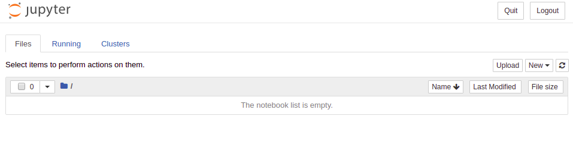

# HackaTEC
 **Evento**: Evento: HackaTEC 2020 <br />
 **Data**: 19 de Janeiro de 2020 de 09:00 às 18:00 e  20 de Janeiro de 2020 de 09:00 às 16:00<br />
 **Local**: HQ da TECNISYS - SIA Trecho 08 lotes 245/255/265 - Brasília - DF | CEP: 71205-080 | Tel: 61 3039-9700<br /><br />
 **Vencedores**: 19:00 do dia 20 de Janeiro de 2020, anúncio dos vencedores<br />
 
 **Colaboradores do hackathon:**  
 
 - Gerdan Santos (Coordenador Técnico da equipe de Inovação e Transformação de Dados )
 - Flaviano Silva (Coordenador Técnico da equipe de .....)
 - abcd (..............)
 - efg de Souza Vieira (..............)
 - Máhijk Beatriz Pereira Domingues (..............)
 - lmnop Conrado Faria Gomes (..............)
 
 # 1. Preparação do Ambiente Jupyter

Para a realização das atividades práticas do hackathon é **necessário** que o participante utilize um dos computadores diponíveis ou traga consigo um notebook com o ambiente [Anaconda](https://www.anaconda.com/distribution/) previamente instalado.
A seguir estão os links diretos para download do Anaconda para cada Sistema Operacional:

 - [Linux](https://repo.anaconda.com/archive/Anaconda3-2019.07-Linux-x86_64.sh)
 - [Windows 64-Bit](https://repo.anaconda.com/archive/Anaconda3-2019.07-Windows-x86_64.exe)
 - [Windows 32-Bit](https://repo.anaconda.com/archive/Anaconda3-2019.07-Windows-x86.exe)
 - [macOS](https://repo.anaconda.com/archive/Anaconda3-2019.07-MacOSX-x86_64.pkg)

Veja os detalhes sobre a instalação na [documentação oficial](https://docs.anaconda.com/anaconda/install/) do Anaconda.


# 2. Criando Ambiente Conda e instalando pacotes
Não obrigatório, apenas para quem precisar de um empurrãozinho com python.

Se você estiver usando o Windows, abra o **Anaconda Prompt**, no Linux ou macOS abra o **terminal**.

Execute o seguinte comando para criar um ambiente conda hackathon:

```bash
#versão do python 3.7 ou versão desejada
conda create --name hackatec python=3.7
```

Ative o ambiente com o seguinte comando:
```bash
conda activate hackatec
```

Execute o comando abaixo para instalar os pacotes que serão utilizados no hackathon:
```bash
conda install jupyter numpy pandas geopandas seaborn matplotlib psycopg2
pip install wtss
```

Registre esse ambiente para ser utilizado no jupyter notebook
```bash
python -m ipykernel install --user --name hackatec --display-name "Python (hackatec)"
```

Verifique se o jupyter notebook está corretamente instalado rodando:
```bash
jupyter notebook
```
Abra o endereço indicado no log do comando acima. Você deverá ver uma página semelhante à figura abaixo. 




# 3. Download Dados

Inicialmente faça a cópia desse repositório para seu computador. Você pode fazer isso usando o git:

```bash
git clone https://github.com/gerdansantos/hackatec.git
